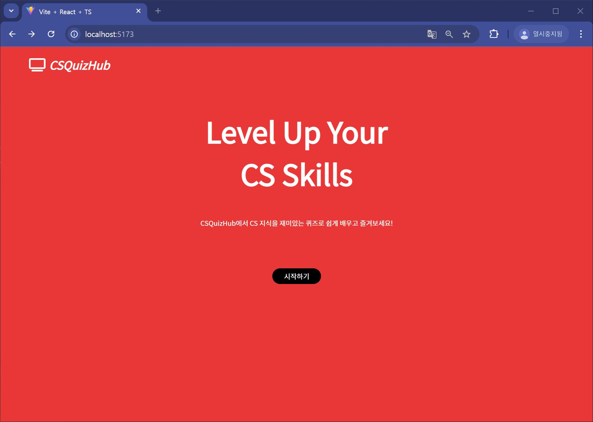
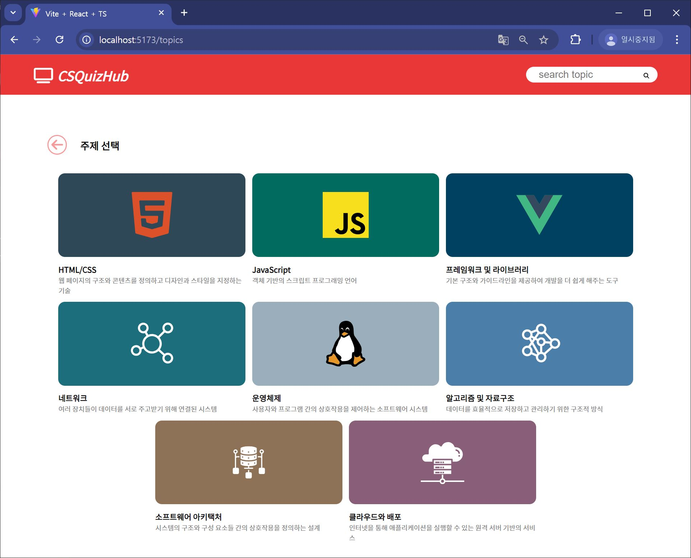
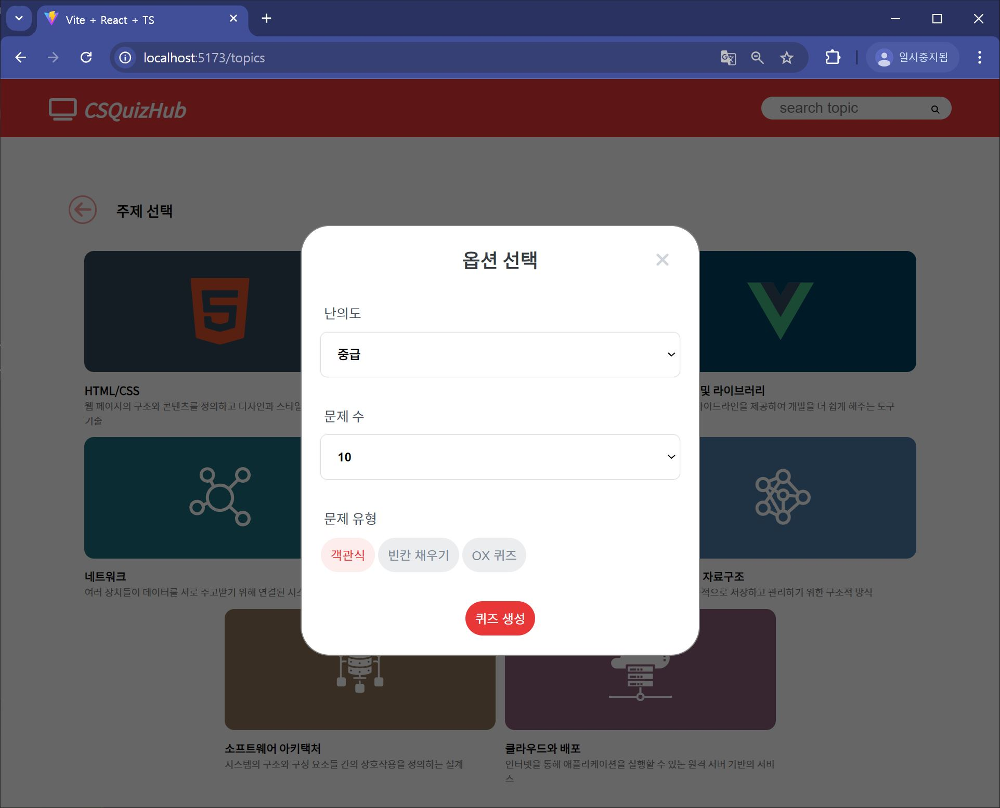
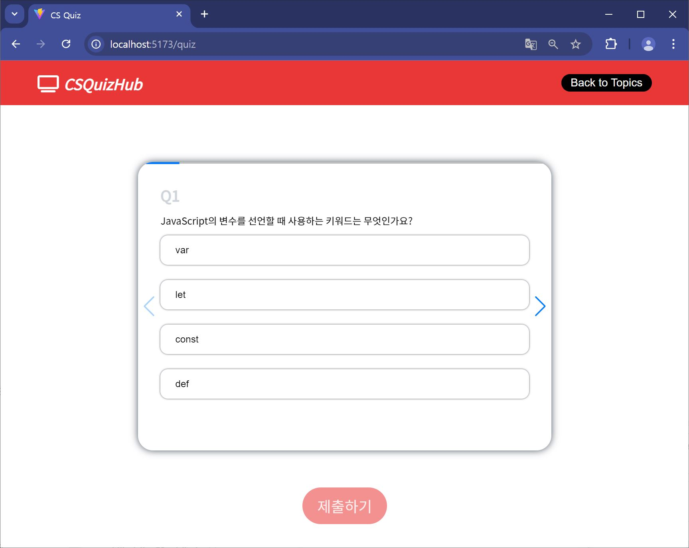
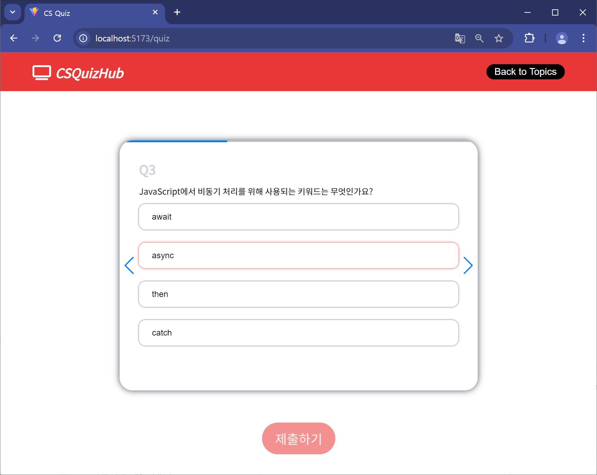
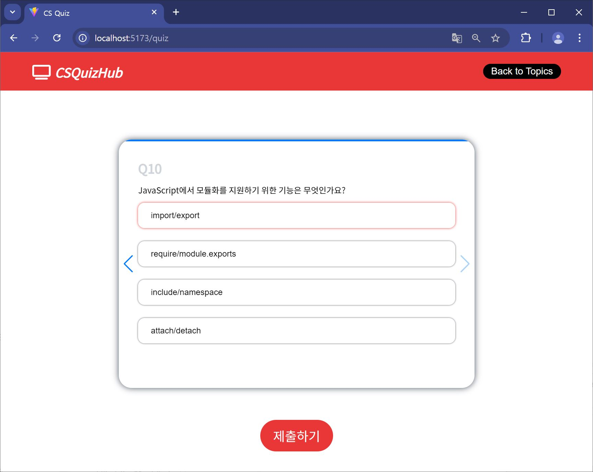
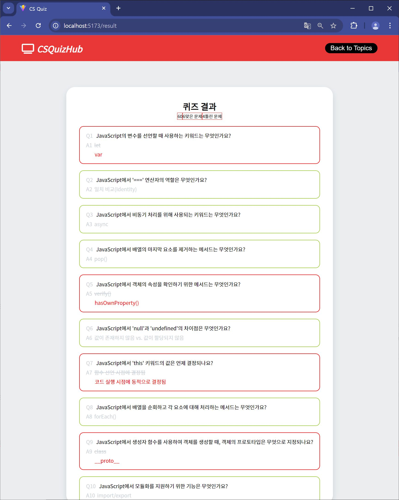

# [FE DevCourse PJ2] CS 퀴즈 사이트 (openai)

> ---
>
> 안녕하세요! 저는 Team 6의 김주영입니다.
>
> 이 프로젝트는 openai api를 사용하여 CS의 여러 주제들에 관한 문제를 생성해주는 사이트입니다.
>
> click -> [배포 링크](https://pj2csquiz.netlify.app) <-
>
> ---

 

1. HomePage :

   홈에는 이 사이트에 대한 설명이 나와있고 시작하기 버튼을 누르면 TopicsPage로 이동합니다.

   

       
       

2. TopicsPage :

   여러가지 CS topic 중 원하는 것을 고를 수 있습니다. 저희가 정한 주제는 다음과 같습니다!

   - HTML/CSS, JS, 프레임워크 및 라이브러리, 네트워크, 운영체제, 알고리즘 및 자료구조, 소프트웨어 아키택처, 클라우드와 배포

   topic을 클릭하면 문제의 난의도와 문제의 개수, 문제의 형식(객관식, OX, 빈칸채우기)을 선택할 수 있는 modal 창이 뜹니다. 퀴즈 생성 버튼을 누르면 LoadingPage로 이동합니다.

   
   

    
    

3. LoadingPage :

   문제를 로딩하는 동안 보여주는 페이지입니다. 로딩이 완료되면 자동으로 QuizPage로 이동합니다.
    
    

4. QuizPage :

   내가 선택한 옵션에 맞는 문제들이 swiper 형식으로 나옵니다. 모든 문제에 대한 정답을 클릭했다면 '제출' 버튼이 활성화 됩니다.

   
   
   

    
    

5. ResultPage:

   문제풀이의 결과가 나옵니다. (해설은 생략)

   

    
    

   ***

   ### 구현하지 못한 부분

   - [ ] search bar 기능
   - [ ] 객관식 외의 다른 문제 유형
   - [x] 모달 닫기 기능
   - [ ] LoadingPage의 css
   - [x] QuizPage의 문제선택/제출 기능
   - [x] ResultPage
   - [x] ResultPage의 채점기능
   - [ ] ~~ResultPage에 띄울 오답해설 쿼리~~
   - [ ] 내 문제 책갈피 기능 / 오답문제 저장 기능 (localstorage)

   ### 해결해야할 오류

   - [ ] TopicsPage에서 화면의 높이가 작아질 경우 scroll시 모달창 뒷부분이 보임
   - [ ] QuizPage로딩 후 문제가 다시 fetch되어서 화면의 문제가 바뀜
   - [ ] QuizPage 새로고침 및 다시 들어왔을 떄 퀴즈가 사라짐
   - [ ] ResultPage에서 채점시 '<', '>' 문자를 '&lt', '&gt'로 저장하여 정답인데 오답이 되는 문제
   - [ ] ResultPage 새로고침 및 다시 들어왔을 떄 모든 정보가 사라짐

   - [ ] 반응형 디자인
   - [ ] 전반적 CSS
